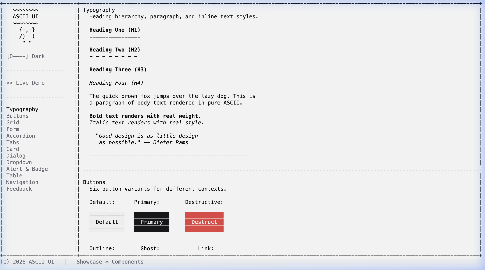

# ASCII UI

```
 █████╗ ███████╗ ██████╗██╗██╗    ██╗   ██╗██╗
██╔══██╗██╔════╝██╔════╝██║██║    ██║   ██║██║
███████║███████╗██║     ██║██║    ██║   ██║██║
██╔══██║╚════██║██║     ██║██║    ██║   ██║██║
██║  ██║███████║╚██████╗██║██║    ╚██████╔╝██║
╚═╝  ╚═╝╚══════╝ ╚═════╝╚═╝╚═╝     ╚═════╝ ╚═╝
~~~~~~~~~~~~~~~~~~~~~~~~~~~~~~~~~~~~~~~~~~~~~~~~~
     Pure ASCII component library for the web
```

## Why?

AI writes your code now. You could build literally anything — a SaaS, an OS, a dating app for your houseplants. I looked at the infinite canvas of possibility and thought: *"What if buttons… but worse?"*

So here we are. 30+ components made entirely of `│`, `─`, and `█`. No canvas. No SVG. No reason. Just vibes and box-drawing characters. 🤷



## ✨ What you get

- **30+ components** — Buttons, inputs, modals, tables, tabs, accordions, sliders, and more
- **Pure ASCII** — Every pixel is a text character
- **Zero dependencies** — Vanilla JS, ~50KB total
- **Theming** — Dark & light, fully customizable
- **Animation** — Built-in motion system
- **Keyboard & Mouse** — Full input handling
- **Responsive** — Auto-sizes to fit any container

## 🚀 Usage

```html
<link rel="stylesheet" href="ascii-ui.css">
<div id="app"></div>

<script type="module">
  import { AsciiUI } from './src/index.js';

  const ui = new AsciiUI('#app', { autoSize: true });

  const panel = ui.panel({ x: 2, y: 2, width: 40, height: 10, title: 'Hello' });

  const btn = ui.button({ x: 4, y: 4, label: 'Click me', variant: 'primary' });
  btn.on.click = () => console.log('Clicked!');
  panel.addChild(btn);

  ui.add(panel);
</script>
```


## 📦 Components

| Category | Components |
|----------|-----------|
| **Layout** | Panel, ScrollContainer, Divider, StatusBar |
| **Typography** | Label (bold, italic) |
| **Buttons** | Button (default, primary, destructive, outline, ghost, link) |
| **Form** | TextInput, Textarea, Select, Checkbox, RadioGroup, Switch, Slider |
| **Data** | Table, ListView, Badge, Meter, ProgressBar, Breadcrumb, Pagination |
| **Feedback** | Alert, Toast, Spinner, Modal, Tooltip |
| **Navigation** | Tabs, Menu, Link, Accordion |

## 🎨 Theming

```javascript
import { zinc, zincLight } from './themes/index.js';

const ui = new AsciiUI('#app', { theme: zinc });

// Switch at runtime
ui.setTheme(zincLight);
```

Roll your own:

```javascript
ui.setTheme({
  normal:  { fg: '#c0c0c0', bg: '#1a1a2e' },
  primary: { fg: '#ffffff', bg: '#e94560' },
  border:  { fg: '#533483' },
  surface: { fg: '#c0c0c0', bg: '#16213e' },
  // ...
});
```


## 📝 License

MIT © 2026
